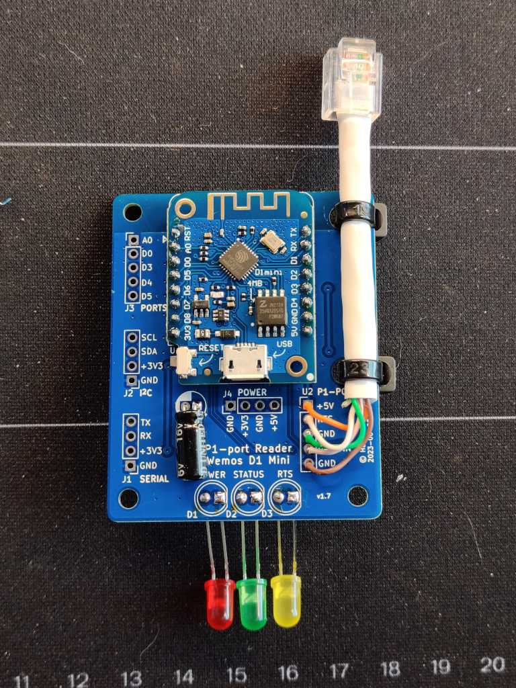
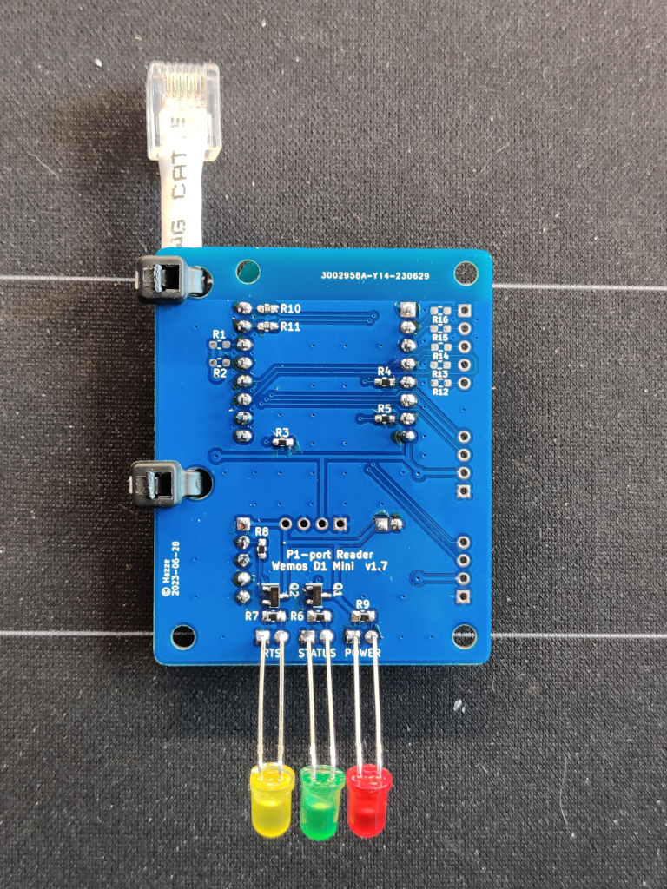
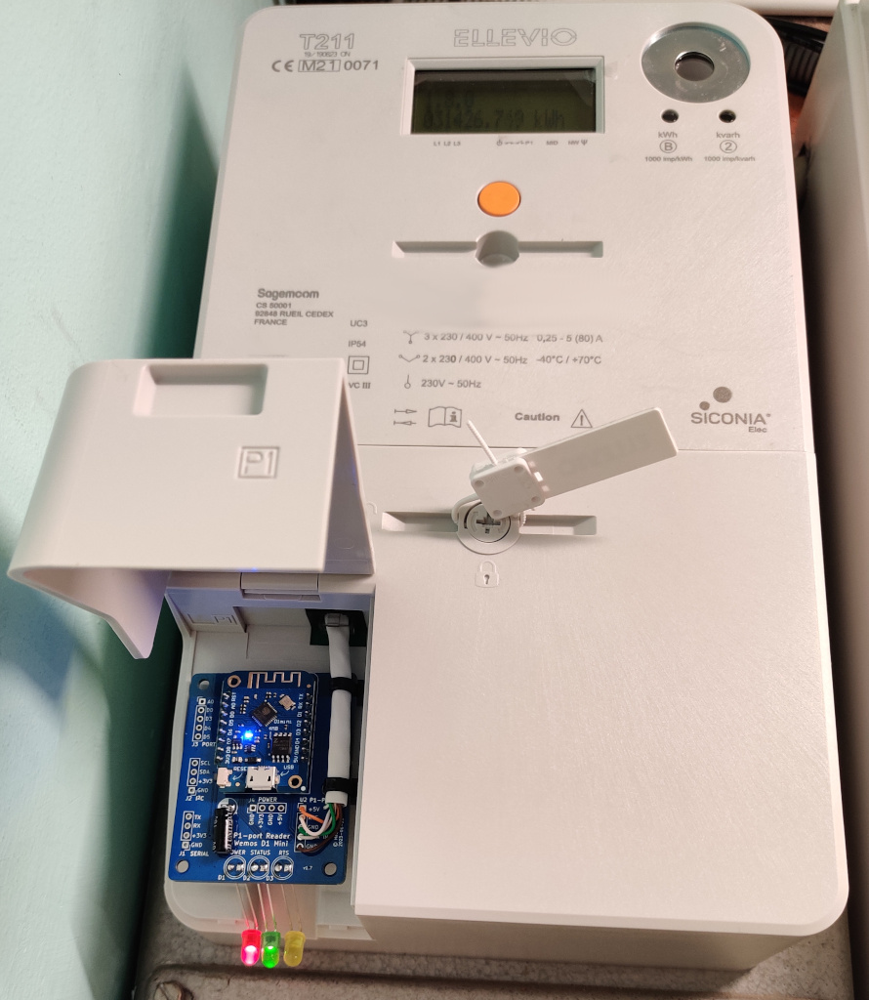
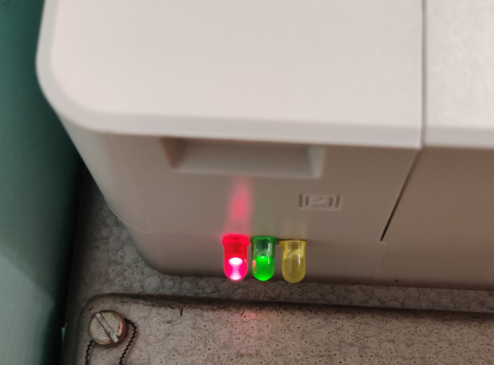

# esphome-p1-reader
Knowing how much electricity you are using has been increasingly important during the past couple of years. It is possible to read off live data such as power, current, and voltage from the power meter using the P1 Port.

A circuit board with a custom design based on the popular P1 Port Reader for using together with Home Assistant to read off data from the Sagemcom T211. It is based on the Wemos D1 Mini board and using ESPHome.

This board fits well into the compartment of the T211 meter so there is no need for any enclosures. As I like indicators this board also features three LED:s that shows power and status which is helpful. The indicators are fed through the small gap in the lid, so there is no need to modify the meter case.

<p float="left">
    
    
    
    
</p>

## Features
* Discrete board that fits neatly into the meter housing of Sagemcom T211 without modifications.
* The board is based on Wemos D1 Mini.
* Values are sent to Home Assistant via ESPHome.
* Requests data from the meter every 15 seconds.
* LED indicators for power and status monitoring.
    * Red LED
      * 5V supply power from meter
    * Green LED
      * Slow flash - Heartbeat indicator circuit is alive
      * Fast flash - Receiving data
      * Status after data reception finished - on = ok, off = failed
    * Yellow LED
      * On - Request for data active (RTS)
      * Off - Request for data acknowledged
* No additional power is needed.
* Optional connectors for future functionality (not implemented).

## Example of data read
This is an example of the actual data read from the meter by the Wemos D1 Mini.
```
[13:37:00][D][exe:390]: > Receiving Telegram ... 
[13:37:00][D][data:403]: > Read line: "/ELL5\nnnnnnnnn_A" length: 17 
[13:37:00][D][data:403]: > Read line: "" length: 0 
[13:37:00][D][data:403]: > Read line: "0-0:1.0.0(000220124115W)" length: 24 
[13:37:00][D][data:403]: > Read line: "1-0:1.8.0(00007874.250*kWh)" length: 27 
[13:37:00][D][data:403]: > Read line: "1-0:2.8.0(00000000.004*kWh)" length: 27 
[13:37:00][D][data:403]: > Read line: "1-0:3.8.0(00000001.910*kvarh)" length: 29 
[13:37:00][D][data:403]: > Read line: "1-0:4.8.0(00008806.040*kvarh)" length: 29 
[13:37:00][D][data:403]: > Read line: "1-0:1.7.0(0001.992*kW)" length: 22 
[13:37:00][D][data:403]: > Read line: "1-0:2.7.0(0000.000*kW)" length: 22 
[13:37:00][D][data:403]: > Read line: "1-0:3.7.0(0000.000*kvar)" length: 24 
[13:37:00][D][data:403]: > Read line: "1-0:4.7.0(0002.025*kvar)" length: 24 
[13:37:00][D][data:403]: > Read line: "1-0:21.7.0(0000.682*kW)" length: 23 
[13:37:00][D][data:403]: > Read line: "1-0:41.7.0(0000.740*kW)" length: 23 
[13:37:00][D][data:403]: > Read line: "1-0:61.7.0(0000.568*kW)" length: 23 
[13:37:00][D][data:403]: > Read line: "1-0:22.7.0(0000.000*kW)" length: 23 
[13:37:00][D][data:403]: > Read line: "1-0:42.7.0(0000.000*kW)" length: 23 
[13:37:00][D][data:403]: > Read line: "1-0:62.7.0(0000.000*kW)" length: 23 
[13:37:00][D][data:403]: > Read line: "1-0:23.7.0(0000.000*kvar)" length: 25 
[13:37:00][D][data:403]: > Read line: "1-0:43.7.0(0000.000*kvar)" length: 25 
[13:37:00][D][data:403]: > Read line: "1-0:63.7.0(0000.000*kvar)" length: 25 
[13:37:00][D][data:403]: > Read line: "1-0:24.7.0(0000.644*kvar)" length: 25 
[13:37:00][D][data:403]: > Read line: "1-0:44.7.0(0000.694*kvar)" length: 25 
[13:37:00][D][data:403]: > Read line: "1-0:64.7.0(0000.686*kvar)" length: 25 
[13:37:00][D][data:403]: > Read line: "1-0:32.7.0(229.6*V)" length: 19 
[13:37:00][D][data:403]: > Read line: "1-0:52.7.0(229.6*V)" length: 19 
[13:37:00][D][data:403]: > Read line: "1-0:72.7.0(231.7*V)" length: 19 
[13:37:00][D][data:403]: > Read line: "1-0:31.7.0(004.1*A)" length: 19 
[13:37:01][D][data:403]: > Read line: "1-0:51.7.0(004.5*A)" length: 19 
[13:37:01][D][data:403]: > Read line: "1-0:71.7.0(003.8*A)" length: 19 
[13:37:01][D][data:403]: > Read line: "!413C" length: 5 
[13:37:01][I][crc:414]: > Read Telegram 30 lines. CRC: 413C = 413C : PASS.
```

The last row contains the CRC check. If you constantly get invalid CRC there might be something wrong with the serial communication.

## ESPHome version
The current version in main is tested with ESPHome version `2023.6.4`. Make sure your ESPHome version is up to date if you experience any compilation problems.

## Verified meter hardware / suppliers
* [Sagemcom T211](https://www.ellevio.se/globalassets/content/el/elmatare-produktblad-b2c/ellevio_produktblad_fas3_t211_web2_.pdf) / Ellevio & Skånska Energi ([Info, port activation, etc.](https://www.ellevio.se/privat/om-din-el/elen-i-hemmet/forsta-din-elmatare/))

## Hardware
I have used a Wemos D1 Mini for my circuit and powers directly from the P1 port. See the [P1-port Reader rev 1.7 schematics](docs/P1-port%20Reader%20rev%201.7%20-%20schematics.pdf) (pdf).

### Parts used for this project
- 1 pcs P1 Port Reader board rev 1.7 (custom design by Hazze Molin)
- 1 pcs Wemos D1 Mini board
- 1 pcs 47uF electrolytic capacitor
- 3 pcs 3k3 0.1W 0603 resistors
- 1 pcs 1k 0.1W 0603 resistor
- 3 pcs 5mm LEDs (red, green and yellow or any colour combination you like)
- 3 pcs 330ohm 0.25W 0805 resistors (adjust resistances depending on actual LEDs used)
- 2 pcs BC817-16 SOT-23 transistors
- 1 pcs RJ12 connector
- 1 pcs short cable with 6 wires
- 2 pcs (optional) 10k 0.1W 0603 resistors (for I2C communication)
- 7 pcs (optional) 100ohm 0.1W resistors (for misc hardware connections)

## Alternative PCB:s and enclosures
* [psvanstrom](https://github.com/psvanstrom) has made the initial release for the NodeMCU ESP-12 / Wemos D1 Mini that I have based my implementation on. 

* [Naesstrom](https://github.com/Naesstrom) has made a nice PCB layout for the P1 reader using a Wemos D1 mini as the controller along with a 3D printable enclosure. 

* [EHjortberg](https://github.com/ehjortberg) has made an equally nice PCB layout based on an ESP07 module along with a 3D printable enclosure.
